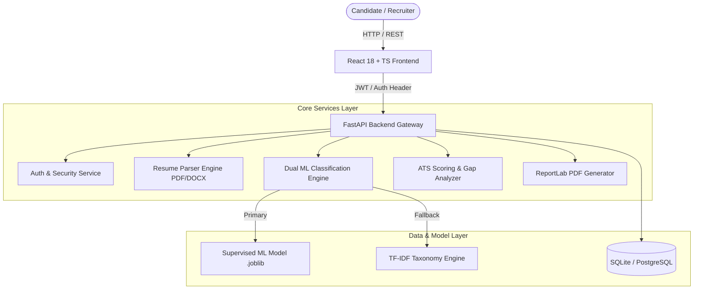

<div align="center">

# 🚀 Smart Resume Classification & AI Career Intelligence Platform

[](https://python.org)
[](https://fastapi.tiangolo.com)
[](https://reactjs.org)
[](https://www.typescriptlang.org/)
[](https://tailwindcss.com)
[](https://www.docker.com)
[](LICENSE)

*An enterprise-grade, full-stack AI SaaS application that automates multi-class candidate resume classification, Applicant Tracking System (ATS) compliance scoring, job-description semantic matching, skill-gap planning, and AI-driven interview preparation.*

[Features](#-key-features) • [System Architecture](#-system-architecture) • [Tech Stack](#-technology-stack) • [Quick Start](#-quick-start) • [ML Pipeline](#-ml-training-pipeline) • [API Reference](#-api-documentation)

</div>

---

## 📌 Executive Summary

**Smart Resume Classification** is a production-ready web application engineered to bridge the gap between candidate qualifications and enterprise hiring expectations. Powered by a dual-engine Machine Learning architecture (Supervised Scikit-Learn Classifier + Transparent TF-IDF Taxonomy Engine), the platform parses, evaluates, and ranks resumes across **16 technical and professional domains**.

Designed with **privacy-first data pipelines**, real-time JWT authentication, role-based admin monitoring, dynamic analytics charts, and downloadable PDF report generation, this repository demonstrates end-to-end full-stack software development, MLOps best practices, and modern UI/UX design.

---

## ✨ Key Features

### 🧠 Dual-Engine AI Resume Classification
* **Multi-Domain Categorization:** Predicts top 5 career classifications across 16 specialized industry sectors (e.g., *Backend Engineering, Data Science, DevOps, Frontend, Product Management*).
* **Supervised & Fallback Modes:** Seamlessly utilizes trained `.joblib` model artifacts or a transparent TF-IDF keyword vectorizer taxonomy when custom models are uninitialized.
* **Confidence & Evidence Insights:** Displays percentage match probabilities along with extracted contextual keywords that drove the prediction.

### 🎯 ATS Compliance & Scoring Engine
* **Holistic Resume Audit:** Calculates an overall ATS score (0–100%) by auditing contact readability, section completeness, formatting cleanliness, and action-verb strength.
* **Granular Deductions:** Highlights explicit formatting penalties (e.g., missing phone number, non-standard section headers, overused passive voice) with actionable fix suggestions.

### 🔍 Job Description Semantic Matching
* **Semantic Alignment:** Compares uploaded candidate resumes against target job descriptions.
* **Skill Intersections & Gaps:** Identifies matching core competencies and extracts missing skills categorized by criticality, learning difficulty, and estimated mastery timeframe.

### 🗺️ AI Career & Skill Growth Roadmap
* **Personalized Learning Paths:** Generates step-by-step career acceleration roadmaps tailored to the candidate's target job role.
* **Impactful Bullet Point Enhancer:** Restructures weak resume bullet points using industry-proven STAR (Situation, Task, Action, Result) formulas without fabricating experience.

### 🎙️ AI Interview Simulator
* **Targeted Question Generation:** Dynamically builds role-tailored technical, HR, behavioral, and project-specific interview prep questions based on detected resume experience levels.

### 📊 Enterprise Dashboard & Admin Suite
* **Interactive Analytics:** Visualizes historical submission trends, domain breakdown distributions, and score metrics using Recharts.
* **Admin Monitoring Console:** System-wide management dashboard with user management, submission telemetry, and operational insights.
* **PDF Report Generation:** One-click export of comprehensive candidate evaluation reports using custom ReportLab engines.

---

## 🛠️ Technology Stack

| Domain | Technologies Used |
| :--- | :--- |
| **Frontend UI / UX** | React 18, TypeScript, Tailwind CSS, Lucide React, Recharts, Vite, Progressive Web App (PWA) support |
| **Backend API Gateway** | Python 3.11+, FastAPI, Pydantic v2, SQLAlchemy ORM, Uvicorn |
| **AI / ML & NLP** | Scikit-Learn, TF-IDF Vectorization, PyPDF2, pdfplumber, python-docx, Joblib |
| **Security & Auth** | OAuth 2.0 (Google Sign-In), JWT Tokens, Passlib (Bcrypt hashing), Role-Based Access Control (RBAC) |
| **Database & Storage** | SQLite (Development), PostgreSQL (Production), ReportLab (PDF Engine) |
| **DevOps & Containerization** | Docker, Docker Compose, Windows Batch Automation Scripts |

---

## 🏗️ System Architecture



---

## 🚀 Quick Start Guide

### Prerequisites
* **Node.js** v20.0 or higher
* **Python** v3.11 or higher
* **Git**

### Option A: One-Click Windows Automated Launch (Recommended)

1. Clone the repository:
   ```bash
   git clone https://github.com/your-username/smart-resume-classification.git
   cd smart-resume-classification
   ```
2. Run automated environment setup:
   ```cmd
   setup-windows.bat
   ```
3. Launch both Frontend and Backend servers:
   ```cmd
   run-windows.bat
   ```
4. Access the web interface at **`http://localhost:5173`** and Swagger API docs at **`http://localhost:8000/docs`**.

---

### Option B: Manual Setup

#### 1. Backend Service
```powershell
# Navigate to backend directory
cd backend

# Create & activate virtual environment
python -m venv .venv
.venv\Scripts\activate      # On Linux/macOS: source .venv/bin/activate

# Environment setup
copy .env.example .env

# Install dependencies
pip install -r requirements.txt

# Start FastAPI server
uvicorn app.main:app --reload --host 127.0.0.1 --port 8000
```

#### 2. Frontend Application
```powershell
# Open a new terminal and navigate to frontend directory
cd frontend

# Environment setup
copy .env.example .env

# Install node dependencies & launch dev server
npm install
npm run dev
```

---

### Option C: Docker Containerization

Run the entire application stack in isolated Docker containers:

```bash
# Copy environment configuration
copy .env.example .env

# Build and start services
docker compose up --build
```
* **Frontend Web App:** `http://localhost:5173`
* **Backend API Gateway:** `http://localhost:8000`
* **Interactive API Docs:** `http://localhost:8000/docs`

---

## 🤖 ML Training Pipeline

The platform includes a dedicated, reproducible pipeline for training custom supervised classifiers.

```bash
cd backend
pip install -r requirements-training.txt

# Train supervised classifier on labeled dataset
python training/train_classifier.py --data /path/to/labeled_resumes.csv --output models/resume_classifier.joblib
```

> [!TIP]
> **Evaluation Metrics Output:** Model training automatically outputs `resume_classifier.metrics.json` evaluating Held-out Accuracy, Weighted F1-Score, Precision, and Recall across all 16 domains. Upon restarting the backend server, the API detects and hot-loads the updated `.joblib` model artifact.

---

## 🔌 API Documentation

FastAPI provides built-in, interactive API documentation accessible directly at `/docs` (Swagger UI) or `/redoc`.

| Endpoint | Method | Description |
| :--- | :--- | :--- |
| `POST /api/v1/auth/register` | `POST` | User registration (Candidate / Admin) |
| `POST /api/v1/auth/token` | `POST` | User login & JWT token generation |
| `POST /api/v1/auth/google` | `POST` | OAuth 2.0 Google authentication |
| `POST /api/v1/resumes/analyze` | `POST` | Primary resume parsing, ML classification & ATS audit |
| `POST /api/v1/resumes/match-job` | `POST` | Job description semantic matching & skill gap report |
| `GET  /api/v1/resumes/history` | `GET` | User-isolated submission audit logs & analytical trend history |
| `GET  /api/v1/resumes/download-pdf/{id}`| `GET` | Generates & downloads a formatted PDF report |
| `GET  /api/v1/admin/stats` | `GET` | System-wide analytics & usage metrics (Admin authorization required) |

---

## 📁 Repository Structure

```text
smart-resume-classification/
├── backend/
│   ├── app/
│   │   ├── api/          # REST Endpoint routes (Auth, Resume, Admin)
│   │   ├── core/         # Security, JWT config, database setup
│   │   ├── ml/           # Dual ML classifier, taxonomy engine, model loader
│   │   ├── models/       # SQLAlchemy ORM models & database schemas
│   │   └── services/     # Parser, ATS scoring, JD matcher, PDF generator
│   ├── models/           # Trained ML .joblib artifacts
│   ├── training/         # Supervised model training scripts & pipeline
│   └── requirements.txt  # Python backend dependencies
├── frontend/
│   ├── public/           # PWA Manifest, favicons, static assets
│   ├── src/
│   │   ├── components/   # Reusable UI components (Navbar, Modals, Cards)
│   │   ├── context/      # React AuthContext & ThemeContext
│   │   ├── pages/        # Landing, Dashboard, Analysis, History, Admin
│   │   ├── services/     # Axios API service integrations
│   │   └── types/        # TypeScript interfaces & type definitions
│   ├── package.json      # Frontend npm dependencies
│   └── tailwind.config.js# Custom Tailwind CSS theme configuration
├── docs/                 # Architectural specifications, security & planning docs
├── docker-compose.yml    # Container orchestration configuration
├── setup-windows.bat     # Windows automated environment builder
└── run-windows.bat       # Windows one-click execution script
```

---

## 🔒 Security & Privacy Features

> [!IMPORTANT]
> * **Data Isolation:** User upload data and submission histories are strictly isolated per authenticated user ID with JWT claim verification.
> * **Password Security:** All authentication passwords are encrypted using `Bcrypt` cryptographic salt hashes before database persistence.
> * **Role-Based Access (RBAC):** Admin endpoints are protected via server-side claims verification (`ADMIN_EMAILS` check).
> * **CORS Controls:** Configurable cross-origin resource sharing rules for production backend deployments.

---

## 🤝 Contributing & Contact

Contributions, issues, and feature requests are welcome! Feel free to check the [issues page](../../issues).

Made with ❤️ by [Selvakumar](https://github.com/Selvakumar246) — *Elevating career tech with Artificial Intelligence.*

---